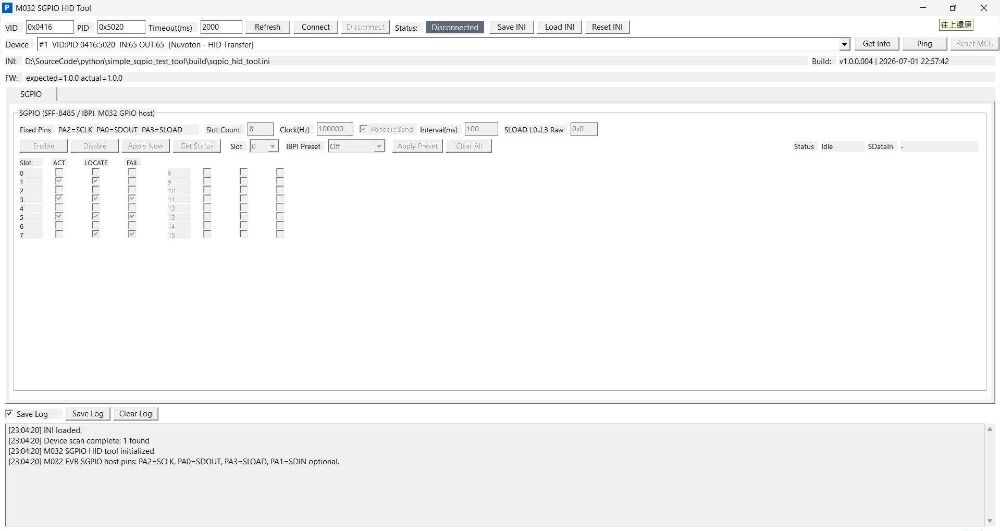

# M032 SGPIO HID Tool

Windows MFC GUI tool and M032/M031 USB HID firmware for using an M032 EVB as an SGPIO host bridge board.

The PC GUI connects to the M032 EVB over USB HID, then asks the bridge firmware to output SGPIO frames on fixed GPIO pins. The main use case is validating external SGPIO target/device firmware such as:

- `M031BSP_Software_SGPIO`
- `M031BSP_SPI_SGPIO`

## Current Scope

- Bridge board: M032 EVB or compatible M031/M032 board running the firmware in this workspace.
- PC transport: Windows HID class driver, 64-byte HID reports.
- SGPIO role: host/initiator output for `SCLOCK/SCLK`, `SDATA OUT`, and `SLOAD`.
- Target validation: 8-slot and 16-slot SGPIO receive/decode testing.
- Clock range: 100 kHz to 400 kHz.
- Not in scope: Pico board support, I2C bridge behavior, PMBus/SMBus tabs, full `SDATA IN` frame capture.

## UI Screenshot



## Quick Start

1. Build and flash the M032 EVB firmware from this workspace.
2. Connect the M032 EVB USB port to the PC.
3. Wire M032 `PA2/PA0/PA3/GND` to the target SGPIO `SCLK/SDATA OUT/SLOAD/GND`.
4. Build or launch the PC tool at `build\SgpioHidTool.exe`.
5. In the GUI, keep VID `0x0416` and PID `0x5020`, then click `Refresh`.
6. Select the bridge device or keep `Auto Select`, then click `Connect`.
7. Click `Get Info`; the firmware should report `m032-sgpio-bridge/1.0.0`.
8. In the `SGPIO` tab, choose slot count, clock, interval, SLOAD raw bits, and slot ACT/LOCATE/FAIL checkboxes.
9. Click `Enable` to start SGPIO output.
10. Verify the target UART log and logic analyzer decode.
11. Click `Disable` before rewiring, reflashing, or changing fixed-pin ownership.

## Hardware Wiring

M032 EVB host bridge to SGPIO target:

| M032 EVB pin | Bridge direction | SGPIO signal | Target side |
| --- | --- | --- | --- |
| `PA2` | Output | `SCLK` / `SCLOCK` | Target clock input |
| `PA0` | Output | `SDATA OUT` | Target data input |
| `PA3` | Output | `SLOAD` | Target frame/load input |
| `GND` | Ground | Ground | Target ground |
| `PA1` | Input | `SDATA IN` optional | Target data output, if available |

The bundled bridge firmware uses fixed pins. The GUI does not expose alternate SGPIO pin mux choices.

For the referenced `M031BSP_Software_SGPIO` target, the default target receive wiring is also `PA2=SCLK`, `PA0=SDATA OUT`, and `PA3=SLOAD`. Its debug UART is typically `UART0` at `115200 8N1`.

For the referenced `M031BSP_SPI_SGPIO` target, keep GUI `SLOAD L0..L3 Raw` at the default `0x0` unless the target firmware explicitly expects another value.

Always connect common ground before SGPIO signals. Check target and EVB voltage domains before wiring.

## Build PC Tool

Supported PC platform:

- Windows 10/11 x64
- Visual Studio 2022 C++ toolchain with MFC support
- Native MFC executable

Build from a Visual Studio developer PowerShell:

```bat
powershell -NoProfile -ExecutionPolicy Bypass -File scripts\build_mfc.ps1 -Configuration Release -Platform x64
```

Output:

- `build\SgpioHidTool.exe`
- `build\obj\x64\Release\...` intermediate build files

Clean command:

```bat
scripts\clean_mfc.bat
```

The clean script removes PC build intermediates and debug artifacts only:

- `build\obj\`
- `build\SgpioHidTool.lib`
- `build\SgpioHidTool.exp`
- `build\*.pdb`, `build\*.ilk`, `build\*.idb`, `build\*.iobj`, `build\*.ipdb`

It intentionally preserves:

- `build\SgpioHidTool.exe`
- `build\sgpio_hid_tool.ini`
- `build\test_log\`

## Build And Flash Firmware

The M032 EVB must be flashed with this workspace HID bridge firmware before the GUI can control SGPIO. The PC GUI alone is not enough; without this firmware, the GUI will not see the expected HID bridge protocol.

Keil project:

- `demo_code\M031BSP_USB_HID_SGPIO\SampleCode\Template\Keil\Template.uvprojx`

Typical flow:

1. Open `Template.uvprojx` in Keil uVision.
2. Select the normal application target.
3. Build the firmware.
4. Flash/download the generated image to the M032 EVB through Nu-Link or the board's configured debug adapter.
5. Reset or power-cycle the EVB.
6. Confirm Windows enumerates the HID device.
7. Launch `build\SgpioHidTool.exe`.
8. Click `Refresh`, `Connect`, `Ping`, and `Get Info`.

Default USB identity:

- VID `0x0416`
- PID `0x5020`

Expected firmware info:

- `m032-sgpio-bridge/1.0.0`

Important firmware files:

- `demo_code\M031BSP_USB_HID_SGPIO\SampleCode\Template\m031_bridge_sgpio.c` - Timer0 + PDMA SGPIO waveform generator.
- `demo_code\M031BSP_USB_HID_SGPIO\SampleCode\Template\m031_bridge_sgpio.h` - SGPIO limits and bridge API.
- `demo_code\M031BSP_USB_HID_SGPIO\SampleCode\Template\hid_tool_api.c` - HID command dispatcher.
- `demo_code\M031BSP_USB_HID_SGPIO\SampleCode\Template\bridge_protocol.h` - HID command IDs and status codes.
- `demo_code\M031BSP_USB_HID_SGPIO\SampleCode\Template\bridge_version.h` - firmware version string.
- `demo_code\M031BSP_USB_HID_SGPIO\SampleCode\Template\hid_transfer.h` - USB VID/PID and HID settings.

## SGPIO Signal Behavior

The bridge emits SGPIO with Timer0-triggered PDMA writes to `PA->DOUT`. One SGPIO clock is built from one low half-period and one high half-period table entry.

Signals:

- `SCLK` / `SCLOCK`: output clock on M032 `PA2`. Targets should sample on the rising edge.
- `SDATA OUT`: output data on M032 `PA0`. This is host-to-target slot state data.
- `SLOAD`: output frame marker on M032 `PA3`. It idles high, goes low for sync, then returns high for the restart marker and L0..L3 bits.
- `SDATA IN`: optional target-to-host input on M032 `PA1`. Current firmware reports the pin level in status but does not implement full returned-frame capture.

Frame layout:

```text
5 clocks    SLOAD=0, SDATA OUT=0 low-sync run
1 clock     SLOAD=1, SDATA OUT=0 restart marker
4 clocks    SLOAD L0..L3 raw bits, LSB-first
N clocks    SDATA OUT ACT, LOCATE, FAIL triplets per slot
pad clocks  SLOAD=1, SDATA OUT=0 until the frame reaches a 16-clock boundary
```

Slot data is LSB slot order. Each slot consumes three `SDATA OUT` bits:

```text
slot N bit 0 = ACT
slot N bit 1 = LOCATE
slot N bit 2 = FAIL
```

Mask bit meaning:

- bit 0 = slot 0
- bit 1 = slot 1
- bit 2 = slot 2
- and so on through slot 15

Example 8-slot pattern:

```text
ACT=0x002A LOCATE=0x00AA FAIL=0x00AA
raw LSB bytes = 38 8E C3
slots = S0=000 S1=111 S2=000 S3=111 S4=000 S5=111 S6=000 S7=011
```

Example 16-slot pattern:

```text
ACT=0x1111 LOCATE=0xAAAA FAIL=0x4444
raw LSB bytes = 11 15 51 11 15 51
slots = S0=100 S1=010 S2=001 S3=010 ... S15=010
```

## GUI Guide

Top-level HID controls:

- `VID` / `PID`: HID filter. Defaults are `0x0416` and `0x5020`.
- `Timeout(ms)`: HID transaction timeout. Default is `2000`.
- `Refresh`: scan matching HID devices.
- `Device`: select a specific scanned device, or keep `Auto Select`.
- `Connect`: open the HID bridge and automatically query firmware info.
- `Disconnect`: close the HID bridge.
- `Get Info`: read the bridge name/version and reset reason.
- `Ping`: basic HID transaction check.
- `Reset MCU`: send bridge reset command, then disconnect and rescan.
- `Save INI` / `Load INI` / `Reset INI`: save, load, or restore GUI state.
- `Save Log`: manually save the visible GUI log when the checkbox is enabled.

SGPIO tab controls:

- `Fixed Pins`: read-only reminder for `PA2=SCLK`, `PA0=SDOUT`, `PA3=SLOAD`, `PA1=SDIN(optional)`.
- `Slot Count`: number of logical slots, `1` to `16`. Use `8` for normal 8-slot tests and `16` for full-width tests.
- `Clock(Hz)`: SGPIO clock. Firmware clamps to `100000` through `400000`.
- `Periodic Send`: when checked, the bridge repeats SGPIO frames.
- `Interval(ms)`: repeat interval. Firmware clamps to `20` through `5000`; `100` ms is a good logic-analyzer bring-up value.
- `SLOAD L0..L3 Raw`: four SLOAD raw bits. Use `0x0` for the current target projects unless a test explicitly needs L0..L3 changes.
- `Enable`: sends SGPIO config/apply commands and starts output.
- `Apply Now`: updates masks/timing while SGPIO is already enabled.
- `Disable`: stops SGPIO and releases the fixed pins to idle.
- `Get Status`: reads firmware state and current `SDATA IN` pin level.
- Slot checkboxes: each row maps to one slot. Check `ACT`, `LOCATE`, and/or `FAIL` to set the corresponding mask bit.
- `Slot` + `IBPI Preset` + `Apply Preset`: quickly apply `Off`, `Activity`, `Locate`, `Fail`, combined states, or `ALL` to one slot.
- `Clear All`: clears all slot ACT/LOCATE/FAIL checkboxes.

Recommended first validation:

1. Set `Slot Count=8`, `Clock=100000`, `Periodic Send=checked`, `Interval=100`, `SLOAD L0..L3 Raw=0x0`.
2. Use checkboxes or presets to create a simple pattern, for example slot 1 `ALL`.
3. Click `Enable`.
4. On the target UART log, confirm the decoded masks and slot list.
5. On a logic analyzer, decode `SCLK`, `SDATA OUT`, and `SLOAD`; confirm five low-sync clocks and the expected raw bytes.
6. Click `Apply Now` after changing masks.
7. Test `Slot Count=16` only after the 8-slot path is stable.

## HID Bridge Protocol

The bridge uses 64-byte HID reports with a fixed 6-byte header:

```text
byte 0      magic 0xA5
byte 1      command
byte 2      sequence
byte 3      status in response
byte 4..5   payload length, little-endian
byte 6..63  payload
```

SGPIO commands:

- `0x74` - SGPIO config, slot count and clock.
- `0x75` - SGPIO apply, enable/periodic/interval/SLOAD/masks.
- `0x76` - SGPIO status.
- `0x77` - SGPIO off.

See `docs\SGPIO_BRIDGE.md` for payload details.

## Configuration

Runtime INI:

- `sgpio_hid_tool.ini`

The default INI is created beside `SgpioHidTool.exe`. Values stored under the exe directory are saved relative to the exe where applicable. For example, the default INI path is saved as:

```ini
[APP]
ini_path=sgpio_hid_tool.ini
```

Saved state includes:

- HID VID/PID
- HID timeout
- selected device label
- save-log checkbox state
- expected and last-seen firmware version
- SGPIO slot count, clock, periodic setting, interval, SLOAD raw bits, and ACT/LOCATE/FAIL masks

This repository intentionally keeps `build\SgpioHidTool.exe`, `build\sgpio_hid_tool.ini`, and sanitized captures under `build\test_log` so first-time users can launch the tool and compare known-good SGPIO logs. Keep these files free of local absolute paths before publishing. Ad-hoc logs saved directly under `build\*.log` remain local-only.

## Project Structure

- `src\` - MFC app, HID transport, SGPIO tab, app state, logging, and config helpers.
- `scripts\` - MFC build, clean, release, and version helper scripts.
- `docs\` - SGPIO bridge protocol notes.
- `demo_code\` - M032 EVB HID bridge firmware project.
- `build\` - generated PC build output and local runtime files.
- `SELF_CHECK.md` - latest verification record.
- `HANDOFF.md` - current implementation handoff notes.
- `AGENTS.md` - local development rules for this workspace.

## GitHub Upload Notes

Before uploading a public copy, keep source, scripts, docs, firmware project files, project metadata, and these user-facing build artifacts:

- `build\SgpioHidTool.exe`
- `build\sgpio_hid_tool.ini`
- `build\test_log\`

Exclude local and generated artifacts:

- `build\obj\`
- `build\*.pdb`, `build\*.ilk`, `build\*.idb`, `build\*.iobj`, `build\*.ipdb`
- `build\*.lib`, `build\*.exp`
- `build\*.log`
- root `teraterm.log`
- Keil `lst\`, `obj\`, `*.uvguix.*`, and local debug-driver INI files

The included `.gitignore` is set up for this split.

Known local-sensitive patterns to watch for before publishing:

- absolute Windows drive or user-profile paths
- user-specific Keil UI files such as `Template.uvguix.<user>`
- Nu-Link local debug configuration files
- logs that include machine paths, COM-port names, or lab-only device serial details

## Verification

PC build:

```bat
powershell -NoProfile -ExecutionPolicy Bypass -File scripts\build_mfc.ps1 -Configuration Release -Platform x64
```

Firmware syntax check, when `arm-none-eabi-gcc` is available:

```bat
arm-none-eabi-gcc -mcpu=cortex-m0 -mthumb -std=gnu99 -fsyntax-only ^
  -Idemo_code\M031BSP_USB_HID_SGPIO\Library\CMSIS\Core\Include ^
  -Idemo_code\M031BSP_USB_HID_SGPIO\Library\Device\Nuvoton\M031\Include ^
  -Idemo_code\M031BSP_USB_HID_SGPIO\Library\StdDriver\inc ^
  -Idemo_code\M031BSP_USB_HID_SGPIO\SampleCode\Template ^
  demo_code\M031BSP_USB_HID_SGPIO\SampleCode\Template\m031_bridge_sgpio.c
```

Hardware smoke test:

1. Flash the firmware to M032 EVB.
2. Launch `build\SgpioHidTool.exe`.
3. Scan/connect VID `0x0416`, PID `0x5020`.
4. Click `Ping`.
5. Click `Get Info`; expect `m032-sgpio-bridge/1.0.0`.
6. Wire `PA2/PA0/PA3/GND` to the SGPIO target.
7. Set `Slot Count=8`, `Clock=100000`, `Periodic Send=checked`, `Interval=100`, `SLOAD L0..L3 Raw=0x0`.
8. Enable SGPIO and confirm target UART decode.
9. Capture `SCLK`, `SDATA OUT`, and `SLOAD` with a logic analyzer.
10. Repeat with a 16-slot pattern after the 8-slot capture is correct.

See `SELF_CHECK.md` for the latest verification result captured in this workspace.
